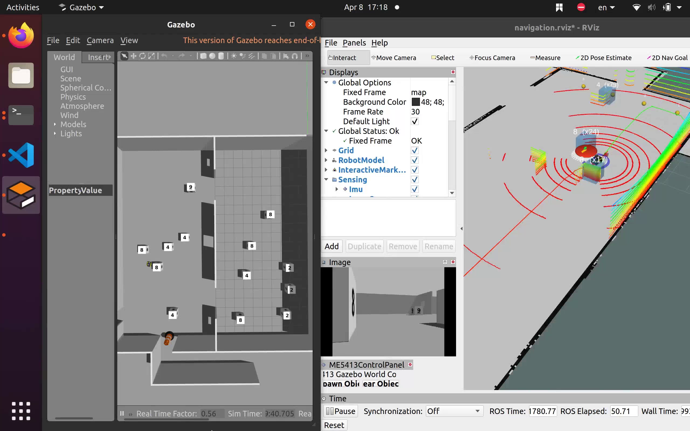

<div align="center">

# ME5413 Final Project
### Autonomous Mobile Robotics Final Project, NUS AY2025/26


</div>

<p align="center">
  
</p>

## Demo Video

A **10× speed demonstration video** of the integrated system is available below:

[](src/me5413_world/video/demo.mp4)

> Click the image above to open the demo video.

## Overview

This repository contains our final submission for **ME5413 Autonomous Mobile Robotics**.  
The project is built on a **Jackal mobile robot** in **Gazebo** with **ROS Noetic**, and completes the full mission pipeline of:

- environment mapping,
- localization and navigation on a saved map,
- autonomous first-floor scanning and box counting,
- door-unblocking and ramp traversal,
- upper-floor gap selection,
- dynamic obstacle avoidance,
- final room selection based on the counting result.

Our implementation follows a practical two-stage workflow:

1. **Offline mapping** using RTAB-Map to generate a stable map.
2. **Online autonomous execution** using `map_server + AMCL + move_base` together with our custom task scripts.

---

## Key Features

- **RTAB-Map based mapping** with RGB-D and point-cloud inputs
- **AMCL + move_base navigation** on a saved 2D occupancy map
- **Automatic floor-1 sweeping and counting** using the front RGB-D camera
- **Gap checking and room selection on floor 2**
- **Dynamic obstacle prediction node** to improve local planning robustness
- **Integrated final demo launch flow** for the full task sequence

---

## Repository Structure

```text
ME5413_Final_Project/
├── src/
│   ├── interactive_tools/          # RViz interaction tools
│   ├── jackal_description/         # Modified Jackal robot description
│   └── me5413_world/
│       ├── config/                 # Navigation / task parameters
│       ├── launch/                 # world, mapping, navigation launch files
│       ├── maps/                   # Saved occupancy map
│       ├── media/                  # Images used in README
│       ├── models/                 # Custom Gazebo models
│       ├── rviz/                   # RViz configurations
│       ├── scripts/                # Python task scripts
│       ├── video/                  # demo video (10x)
│       └── worlds/                 # Gazebo world file
├── LICENSE
└── README.md
```

---

## Environment

Recommended environment:

- **Ubuntu 20.04**
- **ROS Noetic**
- **Gazebo**
- `catkin_make`

Main ROS packages used in this project include:

- `map_server`
- `move_base`
- `amcl`
- `gazebo_ros`
- `teleop_twist_keyboard`
- `jsk_rviz_plugins`
- `jackal_navigation`
- `jackal_gazebo`
- `rtabmap_ros` / `rtabmap_slam`

---

## Quick Start from the ZIP Package

This section is the recommended **compressed-package execution flow** for reproducing our project.

### 1. Unzip the project

```bash
cd ~
unzip ME5413_Final_Project.zip
cd ME5413_Final_Project
```

### 2. Install dependencies

```bash
sudo apt update
rosdep install --from-paths src --ignore-src -r -y
```

If some simulation-related dependencies are still missing, install them manually:

```bash
sudo apt install -y \
  ros-noetic-sick-tim \
  ros-noetic-lms1xx \
  ros-noetic-velodyne-description \
  ros-noetic-pointgrey-camera-description \
  ros-noetic-jackal-control
```

### 3. Prepare Gazebo models

Create the Gazebo model directory if needed:

```bash
mkdir -p ~/.gazebo/models
```

Copy this repository's custom models:

```bash
cp -r ~/ME5413_Final_Project/src/me5413_world/models/* ~/.gazebo/models/
```

Optionally, install the official Gazebo model library as well:

```bash
cd ~
git clone https://github.com/osrf/gazebo_models.git
cp -r ~/gazebo_models/* ~/.gazebo/models/
```

### 4. Build the workspace

```bash
cd ~/ME5413_Final_Project
catkin_make
source devel/setup.bash
```

---

## Final Demo Execution Flow

This is the main flow we used for the final integrated project demonstration.

### Terminal 1: Launch Gazebo world

```bash
cd ~/ME5413_Final_Project
source devel/setup.bash
roslaunch me5413_world world.launch
```

### Terminal 2: Launch full autonomous navigation and task pipeline

```bash
cd ~/ME5413_Final_Project
source devel/setup.bash
roslaunch me5413_world navigation.launch
```

### What `navigation.launch` starts

The integrated launch includes:

- `map_server` loading `src/me5413_world/maps/my_map.yaml`
- `AMCL` localization
- `move_base` with DWA local planner
- RViz visualization
- `dynamic_obstacle_predictor.py`
- `floor1_auto_scan.py`
- `floor2_room_selector.py`

In other words, once the world is up and the navigation launch is started, the full mission stack is ready.

---

## Mapping Workflow

If you want to reproduce the mapping stage separately, use the following procedure.

### Terminal 1: Launch the world

```bash
cd ~/ME5413_Final_Project
source devel/setup.bash
roslaunch me5413_world world.launch
```

### Terminal 2: Start mapping

```bash
cd ~/ME5413_Final_Project
source devel/setup.bash
roslaunch me5413_world mapping.launch
```

### Save the generated map

```bash
cd ~/ME5413_Final_Project/src/me5413_world/maps
rosrun map_server map_saver -f my_map map:=/map
```

The saved map files are then used directly by `navigation.launch`.

---

## Main Output Files

During execution, the main generated result files are:

- `src/me5413_world/maps/my_map.yaml` and `my_map.pgm` — saved navigation map
- `~/.ros/me5413_floor1_counts.json` — floor-1 counting result
- `~/.ros/me5413_floor2_result.json` — floor-2 selection result

---

## Core Scripts

The main custom scripts in this project are:

- `floor1_auto_scan.py`  
  Performs first-floor sweeping, visual box detection, and counting.

- `floor2_room_selector.py`  
  Handles ramp traversal, gap checking, upper-floor decision-making, and final room entry.

- `dynamic_obstacle_predictor.py`  
  Provides predicted obstacle information to improve planning robustness.

---

## Notes

- The default navigation map path is:
  `src/me5413_world/maps/my_map.yaml`
- The project is designed for **ROS Noetic + Ubuntu 20.04**.
- Before running the final demo, make sure the workspace has been built and sourced correctly.
- If Gazebo models fail to load, first check whether `~/.gazebo/models/` contains the required custom models.

---

## GROUP 6 Members

This project was completed by **GROUP 6**:

- **Huang Ruiqi**
- **Jin Feiyi**
- **Li You**
- **Xiao Jinyang**

---

## Acknowledgements

We would like to sincerely thank the **course instructor** and all the **teaching assistants** for their tremendous effort, guidance, and contribution to this course.  
Their support throughout the semester was invaluable to the completion of this project.

---

## License

This project is released under the **MIT License**.
